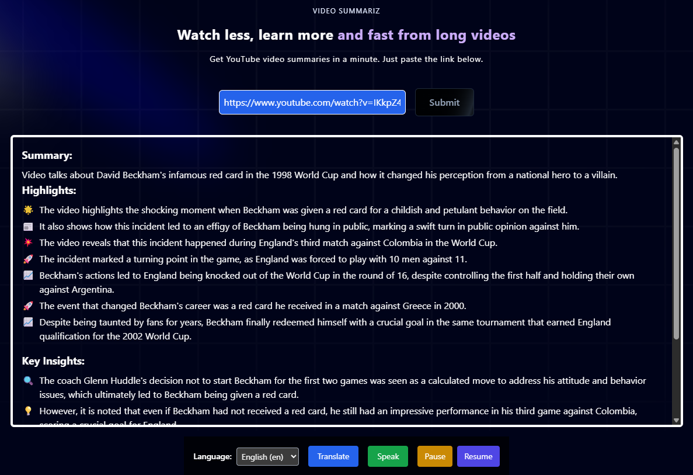
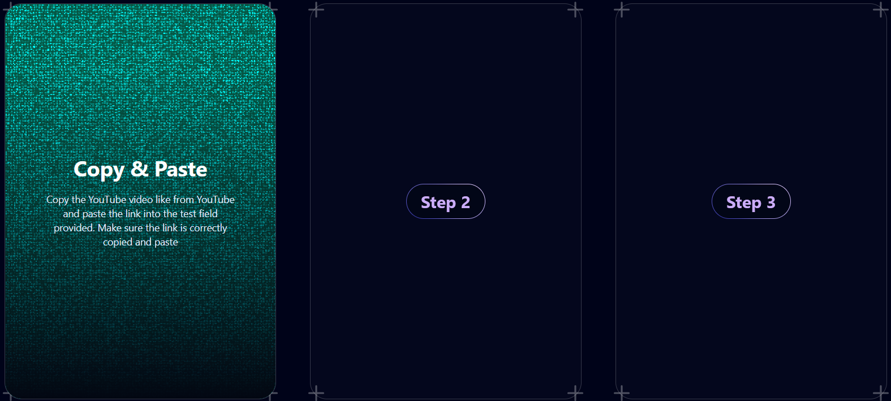

# 🎬 AI-Based YouTube Video Summariser

Paste any YouTube link and instantly receive:
- **Summary** (1-2 lines)  
- **Highlights** (emoji bullet-points)  
- **Key Insights** (take-aways)  
- **Optional translation** into 25+ languages  
- **Text-to-Speech** (Play / Pause / Resume)

| Layer        | Tech stack                                                                                                 | Main file / command                                          |
|--------------|------------------------------------------------------------------------------------------------------------|--------------------------------------------------------------|
| **Back-end** | FastAPI · Ollama (LLaMA 3 7B model) · Google-Translate · YouTube-Transcript-API                           | `model/app.py` → `python app.py` or `uvicorn model.app:app --reload` |
| **Front-end**| Next.js (React 18) · Tailwind CSS · Framer-Motion                                                          | `npm run dev`                                                |

---

## 1 · Quick Start

> **Prerequisites**  
> • Python 3.9+ • Node 18+ / npm 9+ • Git • Ollama (<https://ollama.ai>)


1. Clone the repo
   
    ```bash
    git clone https://github.com/<your-username>/yt-summariser.git
    cd yt-summariser

2. Install back-end deps
   
   ```bash
    python -m venv .venv && source .venv/bin/activate   # optional
    pip install -r requirements.txt

4. Pull the LLaMA 3.2 model (≈4 GB)

   ```bash
    ollama pull llama3.2                                # first-run only

6. Install front-end deps
   ```bash
    npm install

8. Open TWO terminals
   
   ```bash
   python model/app.py    # or: uvicorn model.app:app --reload # – Terminal A (back-end on :8000)
   npm run dev # – Terminal B (front-end on :3000)

6. View in browser
    ```bash
    http://localhost:3000

---

## 2 . Back-end

| Block / function                            | What it does                                                                                                     |
| ------------------------------------------- | ---------------------------------------------------------------------------------------------------------------- |
| **`SummarizeRequest` / `TranslateRequest`** | Pydantic models that validate incoming JSON.                                                                     |
| **`extract_video_id`**                      | Pulls the `v=` parameter out of any YouTube URL.                                                                 |
| **`get_youtube_transcript`**                | Uses **YouTube-Transcript-API** to fetch auto-captions.                                                          |
| **`chunk_transcript`**                      | Splits very long transcripts into \~1 200-word chunks.                                                           |
| **`llm_raw_summary` / `llm_chunk_summary`** | Sends text (or chunk) to **Ollama** running LLaMA 3; prompts it to return “Summary / Highlights / Key Insights.” |
| **`postprocess_summary`**                   | Cleans the model’s output (removes stray phrases, normalises bullets).                                           |
| **`parse_summary_to_json`**                 | Converts cleaned text into JSON lists for easy consumption by the front-end.                                     |
| **`/summarize` route**                      | Full pipeline: extract ID → fetch transcript → summarise → return JSON.                                          |
| **`/translate` route**                      | Pipes any text through Google Translate; splits long inputs into sentences to dodge length limits.               |

---

## 3 . Front-end
  

**Hero.tsx (main component):**  
- **State**  
  - Stores user input (`youtubeUrl`)  
  - Tracks loading (`loading`) and error (`error`) flags  
  - Holds raw summary (`summarizedData`) and translated text (`translatedSummary`, `translatedHighlights`, `translatedInsights`)  
  - Controls sequential reveal (`showSummary`, `showHighlights`, `showInsights`)  

- **handleSummarize**  
  - Sends a POST to `/summarize` with the YouTube URL  
  - On success, stores the JSON response and calls `revealSections()`  
  - `revealSections()` staggers the display of Summary → Highlights → Key Insights via Framer-Motion animations  

- **handleTranslate**  
  - Iterates over the summary, highlights & insights arrays  
  - Sends each string in turn to `/translate`  
  - Updates the translated state arrays (`translatedSummary`, `translatedHighlights`, `translatedInsights`)  

- **Text-to-Speech**  
  - `handleSpeak()` uses the browser’s SpeechSynthesis API to speak the (emoji-filtered) text  
  - `handlePauseSpeech()` & `handleResumeSpeech()` pause and resume ongoing speech  

- **Visuals**  
  - **Spotlight** gradient background elements (Aceternity UI)  
  - **TextGenerateEffect** for animated headline and bullet text reveal  
  - Styled buttons (Submit, Translate, Speak, Pause, Resume)  

- **Networking**  
  - All `fetch` calls target `http://localhost:8000`  
  - `/summarize` returns `{ summary, highlights[], key_insights[] }`  
  - `/translate` returns `{ translated_text }`  
---

## 4 . User Manual

### Front Page


**1. Paste YouTube URL**  
- Locate the input field at the top of the page.  
- Paste your video link (e.g. `https://www.youtube.com/watch?v=...`).  
- Click **Submit** to start summarization.  

**2. View Summary**  
- After a brief loading animation, the **Summary** appears first.  
- This is a 1–2 line overview of “what the video talks about.”  

**3. Browse Highlights**  
- Next, the **Highlights** section reveals key bullet points (each with an emoji).  
- Scroll within the box if there are many points.  

**4. Read Key Insights**  
- Finally, the **Key Insights** section shows deeper take-aways.  
- Use the scrollbar to navigate if needed.  

**5. Change Language**  
- Under the results box, select your preferred language from the **Language** dropdown.  
- Click **Translate** to re-render Summary / Highlights / Insights in that language.  

**6. Listen with Text-to-Speech**  
- Click **Speak** to hear the current text read aloud.  
- Use **Pause** to halt speech mid-stream.  
- Use **Resume** to continue from where it left off.

###  How to Use


**1. What is this section**
- As you scroll down you can see Quick guideline section. 
- Qucik guideline to show how to use this website.  
- Hover the mouse around the each card.  
- The steps will appears.  

---

 ## 🧑‍💻 Author

**Sabarinadh**  
[GitHub Profile](https://github.com/Sabarinadh2002)
